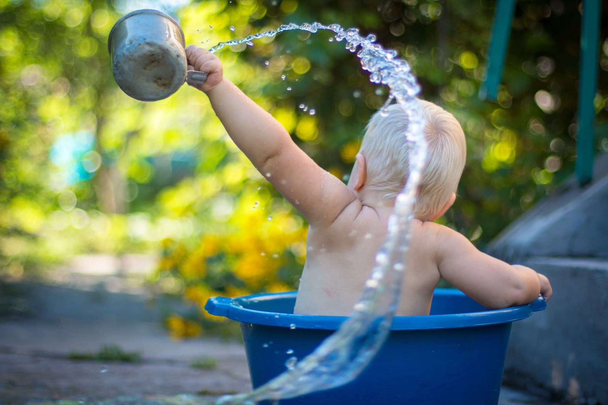

For over 2 months now, I've been turning the water to its coldest setting for 1 minute at the end of my shower. What started as a desire to build resilience has taught me valuable lessons about building habits and consistency.

## Start Small

When I first started my cold shower endeavor, I felt ready to go to the max. I thought, "Why not prove that I'm super tough already and can do 1 minute of cold right away?"

But I had tried to do cold showers before. And, you guessed it, I didn't stick with it for more than a week. I wanted this time around to be different.

I found [an app](https://www.wimhofmethod.com/wim-hof-method-mobile-app) by a guy named [Wim Hof](https://www.wimhofmethod.com/iceman-wim-hof) who is known for pushing his body to the extremes. His recommended approach went something like this:

|         | Cold Water Time | Sessions |
| :------ | :-------------- | :------- |
| Week 1  | 15 seconds      | 5        |
| Week 2  | 30 seconds      | 5        |
| Week 3  | 45 seconds      | 5        |
| Week 4+ | 60 seconds      | 5+       |

The idea is to gradually adjust to the cold. At first, my body wanted to gasp for air because of the cold. The key was to take deep, slow breaths to calm the nervous system and embrace the discomfort.

After a few weeks, 60 seconds of cold was fully integrated into my routine.

## Set Your Default

I've been turning the shower dial to its coldest setting for a couple months. It is what I expect at the end of every shower. But it didn't start that way. I had to reset my default end-of-shower action.

I used to lose track of time standing in the hot water. My mind would wander and I had no trigger to turn the water off. Finishing with cold water gave me a definitive end to the shower.

### If-Then Planning

To set a default action, I did some [If-Then planning](https://patrikedblad.com/habits/if-then-planning/). It follows the template `If [situation], then I will [action]`.

For my cold showers, it looked something like this:

> "If I am at the end of my shower, then I will turn the water to its coldest setting for 60 seconds."

Creating an If-Then plan is a powerful tool for habit building. It helps to attach an action to a specific event, ideally one that is somewhat inevitable and recurring.

The recurring nature of the trigger event will also help develop consistency. I believe consistency is one of the most powerful driving forces of long-term success.

## Focus on the Journey

Consistent cold showers was the only way to train my body for the 60 seconds of cold that I was aiming for. The steps it takes to get to the goal aren't what most people think about when they hear of achievements.

Small, consistent actions are what build success. Therefore, success isn't a destination; It's a journey.

Great walls are not built with one giant brick. They are built _one small brick_ at a time.

Make small, consistent actions the goal.

## Get Comfortable with Discomfort

Consistently taking cold showers isn't relaxing. Your body instinctively wants to get warm again. But it's a great way to get used to being uncomfortable regularly.

Building new habits isn't usually fun. Most people fail to stick to New Year's Resolutions every year **because it's hard**. Embracing the discomfort will mean you don't back down when things get difficult.

## Wrap Up

Cold showers might not be for you, but I have learned many lessons by pursuing them.

### 1. Starting small lowers the motivation needed to make it happen

> "I can easily stand in cold water for 15 seconds!"

### 2. Setting a default action reduces decision making in the moment

> "If I'm at the end of my shower, then I will turn the water to its coldest setting."

### 3. Focusing on the journey means you'll invest in consistency

> "I have to start small at 15 seconds of cold to work on consistent, small actions."

### 4. Embracing discomfort is the name of the game

> "I want to take cold showers to have a win under my belt every day."

Building new habits isn't easy, but most things worth doing are hard.

What's a habit that you want to make consistent? [Send me an email](mailto:brian@brianjdevries.com) with your answer and how you plan to stick with it!
