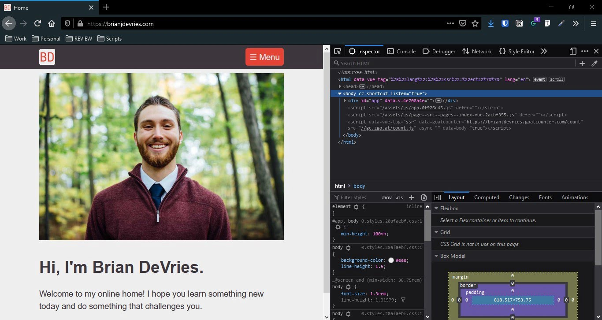

You visit websites every day, but you might not know what the basic building blocks are. Websites are built with 3 fundamental pieces: HTML, CSS, and JavaScript.

HTML elements are the bones of the web page. CSS is the skin and appearance of the site. JavaScript acts as the muscles, running functional scripts to execute logic. I'll show you how to take a look at source HTML of a website.

## View web page source html

When I press `F12` in my browser, the Developer Tools window will open. Before learning about HTML and web development, this window would only pop up by accident.



When the Developer Tools window is open, you can see all the markup that makes up the web page. I'll give an overview of HTML so you can start learning yourself.

## Web page structure

HTML elements are the building blocks. These blocks consist of a start and end tag indicating what type of block it is. Every web page has a standard structure.

```html
<!DOCTYPE html>
<html>
  <head>
    ...
  </head>

  <body>
    ...
  </body>
</html>
```

All html documents start with `<!DOCTYPE html>` to indicate to the browser what type of document it is.

The `<html></html>` block holds all other blocks within the web page.

The two main blocks within the `html` element are the `head` and `body` blocks.

The `head` element holds markup that will support the document, such as `title`, `meta`, `link`, `style` and `script` tags.

The `body` element holds all other blocks of the web page. I'll go over some of the most common elements in a bit.

### Properties

Most elements can contain IDs, classes, styles, and more.

```html
<p id="paragraph-1" class="example-class" style="color: red;">This is a paragraph</p>
```

These can be used to add CSS styles, reference the element in a JavaScript function, and more. Now let's look at some common HTML elements.

## Common HTML elements

### div

The `<div></div>` element is very common block element in HTML. It mostly acts as a grouping element to hold smaller pieces together.

### p

The `<p></p>` element represents a paragraph.

### a

The `<a></a>` tag is what gives the **web** its name. `a` is the hyperlink tag that points to other websites, creating the "web" of site pages. The `href` property holds the site that the tag references.

```html
<a href="https://brianjdevries.com">Brian's site</a>
```

The above code becomes [Brian's site](https://brianjdevries.com).

### h1..h6

Heading tags span from `h1` to `h6` and indicate document levels. They typically have decreasing font size as the heading number increases.

### img

The `` element allows you to embed images within web pages. This is an example of a self-closing tag.

```html

```

This is the image that shows from the above `img` element.


### link

The `<link />` element is a non-visual element used to import stylesheets and images to the document.

```html
<link rel="stylesheet" href="./style.css">
```

The above snippet will use the `style.css` document to format the document and add css to the markup. We'll cover CSS later.

## Wrap up

HTML is how web documents are formatted. Numerous elements are available to communicate what content is and how it should be displayed in the browser. Building websites with proper HTML elements also allows screen readers to access web content. Less able people can then also interact with websites and navigate them.

This is just a brief introduction to HTML. More information can be found in the [MDN web docs][mozilla].

Go ahead, press `F12` on this page and take a look at the HTML structure. You won't break anything, but you will learn something!

Give me a shout if you liked this post, I love talking with others about all things web.

[mozilla]: https://developer.mozilla.org/en-US/docs/Learn/HTML/Introduction_to_HTML/Getting_started "Getting started with html"
